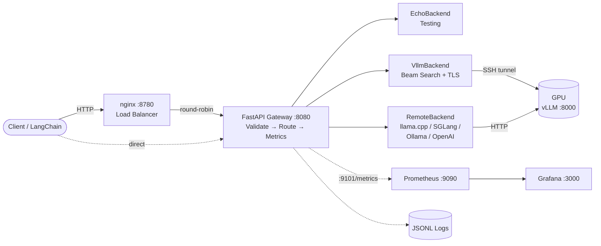
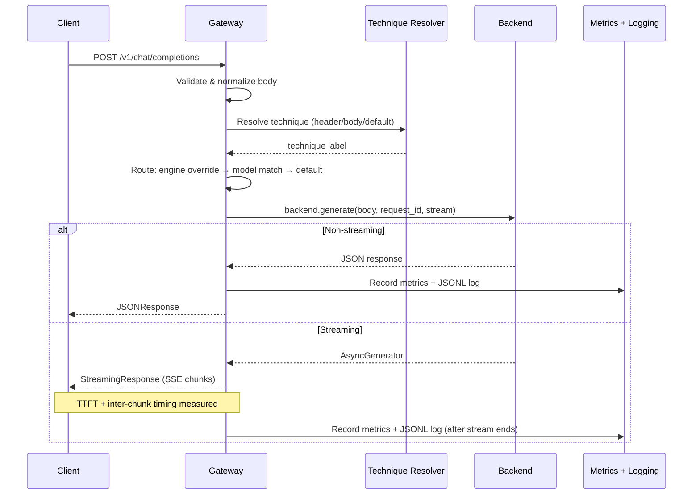
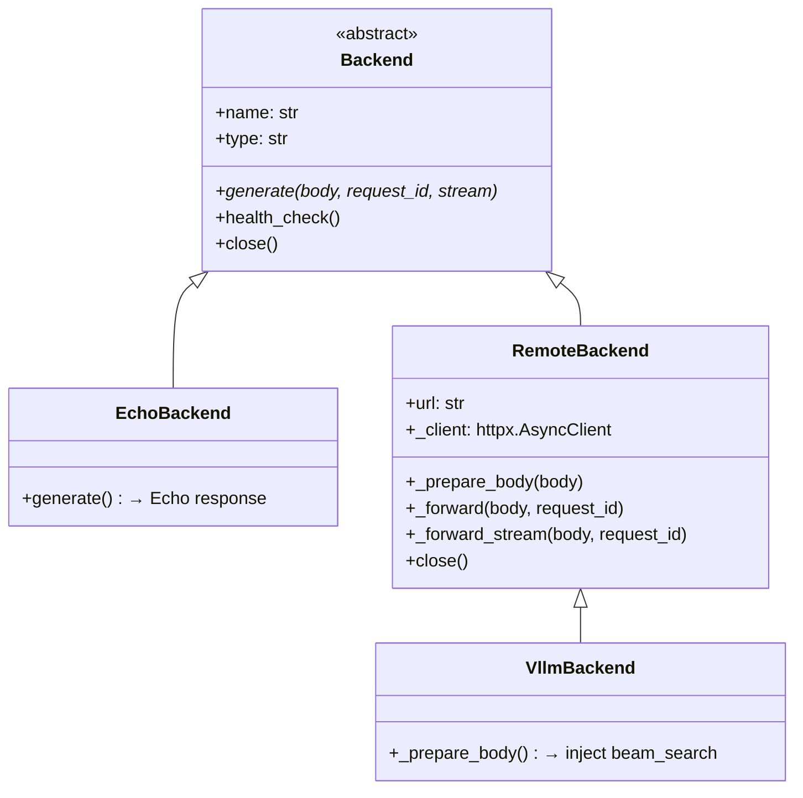

# Architecture

## System Overview



```
Client Request
    ↓
[nginx :8780]  ← optional load balancer (round-robin)
    ↓
[FastAPI gateway :8080]  ← validation, routing, metrics
    ↓
[Backend]  ← echo (testing) | vllm | remote (generic)
    ↓
[vLLM :8000]  ← via SSH tunnel to cloud GPU
```

The gateway is an OpenAI-compatible HTTP proxy. It validates requests, resolves technique labels, selects a backend, forwards the request, records metrics, logs the result, and returns the response.

### Request Flow Detail



## Module Map

| Module | Purpose |
|--------|---------|
| `app.py` | FastAPI routes, exception handlers, streaming instrumentation, entry point |
| `gateway.py` | Pure logic: validation, normalization, response builders (no framework imports) |
| `config.py` | `BackendRegistry` — loads `config.yaml`, creates backend instances |
| `technique.py` | Technique resolution (`X-Technique` header / body / default) and engine routing |
| `metrics.py` | Prometheus metric definitions, recording helpers, summary endpoint data |
| `cost.py` | Per-request GPU cost estimation from duration × hourly rate |
| `lambda_pricing.py` | Optional Lambda Cloud API pricing lookup (cached) |
| `request_logger.py` | JSONL per-request logging with daily file rotation |
| `tracing.py` | Optional OpenTelemetry setup (no-op when `OTEL_EXPORTER_OTLP_ENDPOINT` unset) |
| `backends/backend.py` | Abstract `Backend` base class |
| `backends/echo.py` | `EchoBackend` — echoes user message back (testing) |
| `backends/remote.py` | `RemoteBackend` — forwards to any OpenAI-compatible API |
| `backends/vllm.py` | `VllmBackend(RemoteBackend)` — adds beam search injection + TLS verify |

## Request Lifecycle

### Non-Streaming

1. **Parse** — `await request.json()`
2. **Validate** — `validate_request_body()` checks messages, types, ranges → 400 if invalid
3. **Normalize** — `normalize_request_body()` strips unknown fields, defaults `stream=False`
4. **Extract metadata** — resolve request ID (header or UUID), resolve technique label
5. **Route** — engine routing override (env vars) → model-based registry lookup → default backend
6. **Generate** — `backend.generate(body, request_id, stream=False)` → upstream HTTP call
7. **Fallback** — if backend raises, try fallback backend (if configured and different)
8. **Record** — compute cost, record Prometheus metrics, write JSONL log entry
9. **Return** — `JSONResponse(result)` with `X-Request-ID` and `X-Technique` headers

### Streaming

Steps 1–6 are identical. At step 6, `generate()` returns an async generator instead of a dict.

7. **Wrap** — `_instrumented_stream()` wraps the generator to measure TTFT and inter-chunk delays
8. **Return** — `StreamingResponse(wrapped_generator, media_type="text/event-stream")`
9. **Record** — metrics and logging happen *after* the generator completes (inside the wrapper)

Key insight: the handler returns *before* streaming finishes. `StreamingResponse` consumes the generator asynchronously, so metrics recording happens in the generator's cleanup, not in the handler.

## Backend Architecture



```
Backend (ABC)
├── generate(body, request_id, stream) → dict | AsyncGenerator
├── health_check() → {"status": "ok"|"error", ...}
└── close() → clean up resources

EchoBackend(Backend)
└── Returns "Echo: <last user message>"

RemoteBackend(Backend)
├── Shared httpx.AsyncClient with connection pooling
├── _prepare_body(body) → hook for subclasses
├── _forward(body, request_id) → dict (non-streaming)
├── _forward_stream(body, request_id) → AsyncGenerator (streaming)
└── health_check() → GET {url}/health with 5s timeout

VllmBackend(RemoteBackend)
├── _prepare_body(body) → inject beam_search params, strip "technique"
└── Passes TLS verify flag from VLLM_TLS_VERIFY env var
```

Adding a new backend type requires:
1. Subclass `Backend` (or `RemoteBackend`)
2. Implement `generate()`
3. Add to `backends/__init__.py`
4. Add type mapping in `config.py:from_config()`

Zero changes to `app.py` — the handler is backend-agnostic.

## Streaming Protocol

The gateway speaks OpenAI-compatible Server-Sent Events (SSE):

```
data: {"id":"req-123","object":"chat.completion.chunk","choices":[{"delta":{"content":"Hello"},"finish_reason":null}]}

data: {"id":"req-123","object":"chat.completion.chunk","choices":[{"delta":{},"finish_reason":"stop"}]}

data: [DONE]
```

Each chunk is a `data:` line followed by `\n\n`. The gateway passes upstream SSE lines through as-is (for remote/vllm backends) or generates them (for echo backend).

`proxy_buffering off` in nginx is critical — without it, nginx buffers the entire response before forwarding, breaking real-time streaming.

## Error Handling

| Exception | HTTP Status | Response |
|-----------|-------------|----------|
| `httpx.HTTPStatusError` | 502 | `{"error": "backend_error"}` |
| `httpx.ConnectError` | 502 | `{"error": "backend_unavailable"}` |
| `httpx.TimeoutException` | 504 | `{"error": "gateway_timeout"}` |
| `httpx.ReadError` / `WriteError` | 502 | `{"error": "backend_error"}` |
| `BackendJSONError` | 502 | `{"error": "backend_error"}` |

When the primary backend fails and a `fallback_backend` is configured (and differs from the primary), the gateway retries with the fallback. Successful fallback responses include `X-Fallback: true` header and `"fallback": true` in the JSON body.

## Separation of Concerns

- **`gateway.py`** has zero framework imports — pure functions for validation, normalization, and response building. Testable without FastAPI.
- **`app.py`** is the only file that imports FastAPI. It orchestrates the request lifecycle by calling into `gateway.py`, `technique.py`, `metrics.py`, etc.
- **`config.py`** is the only file that reads `config.yaml`. The rest of the codebase works with `Backend` instances.
- **Metrics, logging, tracing** are wired in `app.py` but defined in their own modules. Each can be disabled independently.
