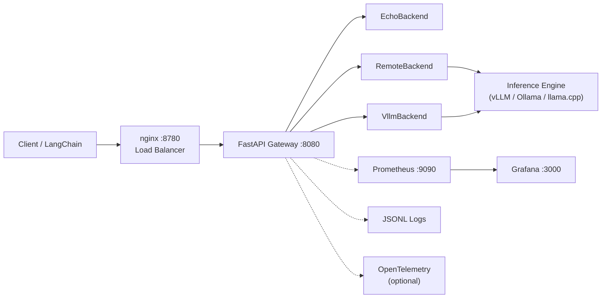
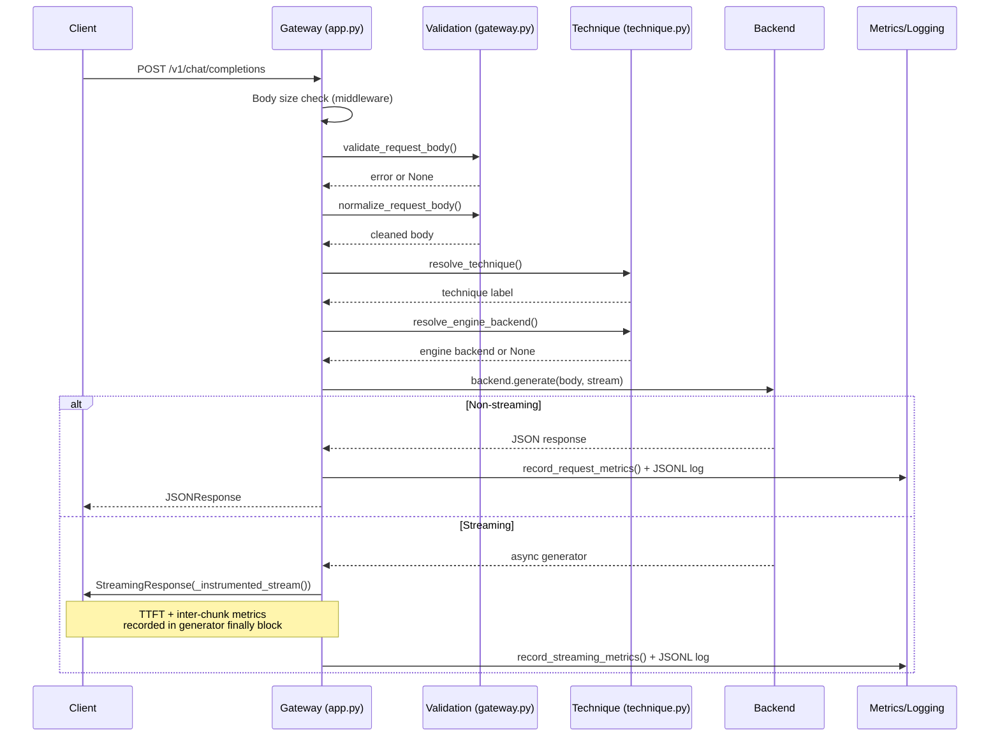
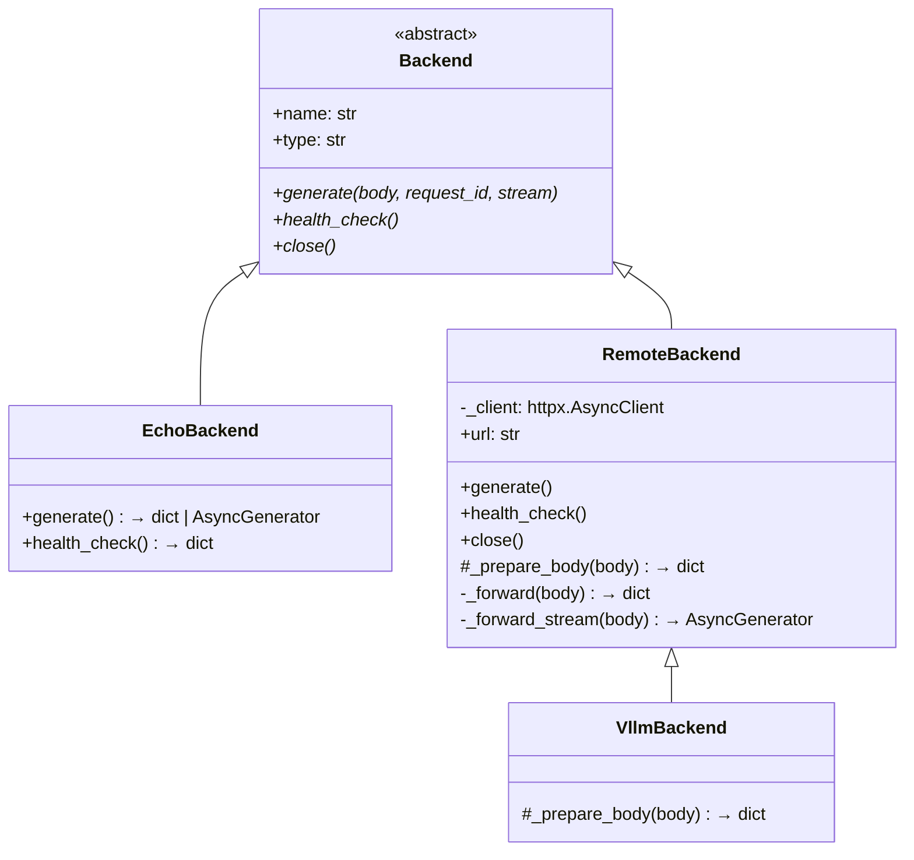
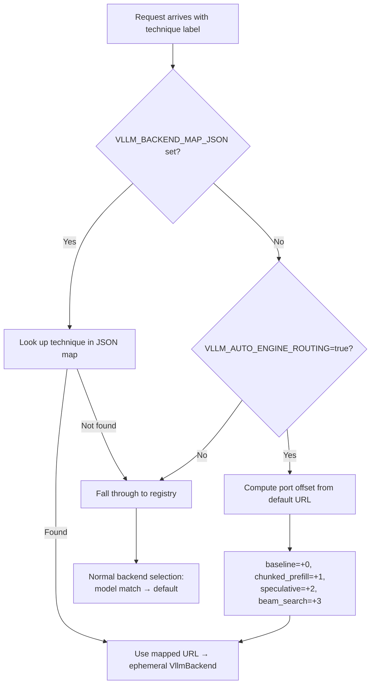

# Inference Gateway — Internals Report

## Abstract

The Inference Gateway is an OpenAI-compatible HTTP proxy that unifies access to multiple ML inference engines—vLLM, Ollama, llama.cpp, SGLang, and others—behind a single API. It provides technique-labeled routing for A/B testing across engine configurations, full observability (Prometheus metrics, JSONL request logs, optional OpenTelemetry tracing), per-request GPU cost tracking, and a pre-configured Grafana monitoring stack. The system comprises 1,541 lines of Python across 13 core modules, 30 automated tests with 74 assertions, and achieves 1,063 req/s gateway throughput with 42ms overhead at p50. It has been tested against vLLM on both a local RTX 3090 and a Lambda Cloud A10 GPU, sustaining 219 req/s with zero errors at 50 concurrent connections.

---

## 1. Motivation and Problem Statement

ML inference engines each expose different APIs, require different startup flags, and have varying compatibility with features like streaming. Comparing engine configurations—chunked prefill vs. baseline, speculative decoding vs. standard autoregressive—requires restarting the server with different flags, which makes controlled A/B testing difficult.

The Inference Gateway solves four problems:

1. **Unified API**: A single OpenAI-compatible endpoint (`/v1/chat/completions`) that works with any backend, so clients (LangChain, custom scripts, curl) never need to know which engine is running.
2. **Technique-labeled routing**: Requests carry a technique label (e.g., `baseline`, `chunked_prefill`, `speculative`) that determines which backend or engine instance handles them, enabling side-by-side comparison without code changes.
3. **Production observability**: Prometheus metrics with ML-specific measurements (time to first token, tokens/sec, inter-chunk delay), structured JSONL logs, and optional distributed tracing—all without modifying the inference engine.
4. **Zero-change extensibility**: Adding a new backend type requires implementing a single abstract class; no changes to the routing, metrics, or logging code.

---

## 2. System Architecture

### 2.1 High-Level Overview



### 2.2 Request Lifecycle



A key architectural insight: for streaming responses, the handler returns a `StreamingResponse` *before* the generator completes. Metrics and logging happen inside the generator's `finally` block (`app.py:204-219`), ensuring they execute even if the client disconnects mid-stream.

### 2.3 Module Map

| Module | Lines | Responsibility |
|--------|-------|----------------|
| `app.py` | 322 | FastAPI routes, exception handlers, streaming instrumentation, entry point |
| `gateway.py` | 162 | Request validation, normalization, response builders — **zero framework imports** |
| `config.py` | 86 | YAML config parsing, `BackendRegistry` with default/fallback resolution |
| `technique.py` | 92 | Technique resolution (3-tier priority), engine routing (3 strategies) |
| `metrics.py` | 147 | Prometheus metric definitions and recording helpers |
| `request_logger.py` | 64 | Async JSONL per-request logging with daily rotation |
| `tracing.py` | 53 | Optional OpenTelemetry setup, zero overhead when disabled |
| `cost.py` | 16 | Per-request GPU cost estimation |
| `lambda_pricing.py` | 50 | Lambda Cloud API pricing lookup (optional) |
| `backends/backend.py` | 22 | Abstract base class (`Backend` ABC) |
| `backends/echo.py` | 32 | Test backend — echoes user message |
| `backends/remote.py` | 95 | Generic OpenAI-compatible backend with connection pooling |
| `backends/vllm.py` | 23 | vLLM-specific: beam search injection + TLS toggle |

> See also: [docs/architecture.md](architecture.md) for detailed flowcharts and the full request lifecycle narrative.

---

## 3. Code Design and Patterns

### 3.1 Framework-Agnostic Core

`gateway.py` contains all request validation, normalization, and response building logic. Its imports are exclusively from the standard library:

```python
import json
import time
import uuid
from typing import Any
```

No FastAPI, no httpx, no Prometheus. This means:

- **Testability**: Every function can be tested with plain `assert` statements—no need to spin up an ASGI app.
- **Portability**: The core logic could be reused with Flask, Starlette, or any other framework.
- **Clarity**: The request lifecycle is explicit in `app.py`, which calls into `gateway.py` as a library rather than relying on decorators or middleware magic.

`app.py` is the only module that imports FastAPI. It orchestrates the lifecycle by composing pure functions from `gateway.py`, routing logic from `technique.py`, and recording from `metrics.py`.

### 3.2 Backend Polymorphism



The backend hierarchy uses the **Template Method pattern**: `RemoteBackend._prepare_body()` is a hook that returns the body unchanged by default. `VllmBackend` overrides it to inject beam search parameters when `technique="beam_search"` and strip the `technique` field that vLLM would reject (`backends/vllm.py:16-23`).

Adding a new backend (e.g., TensorRT-LLM) requires:
1. Subclass `Backend` (or `RemoteBackend` for OpenAI-compatible engines)
2. Implement `generate()`, `health_check()`, `close()`
3. Register the type string in `config.py:56-73`

No changes to `app.py`, `metrics.py`, or any other module.

### 3.3 Connection Pooling

`RemoteBackend` creates a single shared `httpx.AsyncClient` per backend instance (`backends/remote.py:15-19`):

```python
self._client = httpx.AsyncClient(
    timeout=120,
    verify=verify,
    limits=httpx.Limits(max_connections=100, max_keepalive_connections=20),
)
```

This avoids TCP+TLS handshake overhead on every request. At 219 req/s, this is critical—without pooling, connection setup alone would dominate latency. The client is closed during gateway shutdown via `close()` (`backends/remote.py:93-95`), which `app.py` calls in the lifespan context manager.

### 3.4 Eager Connect for Streaming

In `RemoteBackend._forward_stream()` (`backends/remote.py:64-80`), the HTTP connection is established and the status code checked *before* returning the async generator:

```python
request = self._client.build_request("POST", url, json=body, headers=headers)
resp = await self._client.send(request, stream=True)
try:
    resp.raise_for_status()
except Exception:
    await resp.aclose()
    raise
return self._stream_lines(resp)
```

This prevents a common bug: if errors are discovered only after `StreamingResponse` has started sending, the HTTP status code is already 200 and cannot be changed. Eager connect ensures error responses (502, 504) are returned correctly.

### 3.5 Configuration as Source of Truth

`config.py` is the single module that reads `config.yaml`. The `BackendRegistry.from_config()` class method (`config.py:36-86`) validates all backends at startup:

- Missing `url` fields raise `ValueError` immediately
- Unknown `default_backend` references fail fast
- Invalid `fallback_backend` references are caught before the first request
- If no config file exists, the system degrades gracefully to an echo-only backend

The rest of the system operates on `Backend` instances, never on raw config dictionaries.

> See also: [docs/configuration.md](configuration.md) for the full config reference and supported engine types.

---

## 4. Request Lifecycle Deep Dive

A step-by-step walk through `POST /v1/chat/completions` in `app.py`:

1. **Body size check** (line 117-122): Middleware reads `Content-Length` and returns 413 if it exceeds `MAX_BODY_BYTES` (default 1MB).

2. **JSON parsing** (line 225): `await request.json()` parses the body.

3. **Validation** (line 226-228): `gateway.validate_request_body()` checks 6 fields:
   - `messages`: required, must be list of `{role: str, content: str}` dicts
   - `stream`: optional, must be bool
   - `max_tokens`: optional, int in [1, 128000]
   - `model`: optional, must be string
   - `temperature`: optional, float in [0.0, 2.0]
   - `stop`: optional, string or list of strings

4. **Normalization** (line 229): `gateway.normalize_request_body()` strips unrecognized fields (allowlist: `messages`, `stream`, `max_tokens`, `model`, `temperature`, `stop`, `metadata`) and defaults `stream=False`.

5. **Request ID** (line 231): Extracted from `X-Request-ID` or `Request-ID` headers, or generated as UUID.

6. **Technique resolution** (line 232): Three-tier priority:
   - `X-Technique` header (if value is in `KNOWN_TECHNIQUES`)
   - `metadata.technique` in request body
   - Falls back to `"baseline"`

7. **Backend selection** (lines 237-245): Three-tier routing:
   - Engine routing override (env-var driven) → ephemeral `VllmBackend`
   - Model name matches a registered backend → use that backend
   - Otherwise → default backend

8. **Generation** (line 250): `backend.generate(body, request_id, stream)` calls the upstream engine.

9. **Fallback** (lines 251-285): If the primary backend raises a connection/timeout/HTTP error and a fallback is configured, the request is retried against the fallback. Response includes `X-Fallback: true` header.

10. **Metrics + logging** (lines 296-309): `record_request_metrics()` records Prometheus histograms/counters, `req_logger.log()` writes the JSONL entry.

11. **Response** (line 310): `JSONResponse` with `X-Request-ID` and `X-Technique` headers.

For **streaming**, the generator is wrapped in `_instrumented_stream()` (lines 182-219) which measures TTFT (time from start to first chunk) and inter-chunk delays. Metrics are recorded in the `finally` block to ensure they execute regardless of client disconnection or errors.

> See also: [docs/api-reference.md](api-reference.md) for the complete endpoint specification with request/response formats.

---

## 5. Backend System

### 5.1 EchoBackend (32 lines)

Returns `"Echo: {last user message}"` using `gateway.build_response()`. For streaming, generates SSE chunks character-by-character using `gateway.build_sse_chunk()`. Zero external dependencies.

**Purpose**: Local development without a GPU, gateway throughput benchmarking (isolates gateway overhead from inference latency), and automated testing (all 30 tests use echo mode).

### 5.2 RemoteBackend (95 lines)

Forwards requests to any OpenAI-compatible API. Key implementation details:

- **Non-streaming** (`_forward`, line 51-62): `POST` to `{url}/v1/chat/completions`, parse JSON response. Raises `BackendJSONError` if the response isn't valid JSON.
- **Streaming** (`_forward_stream`, line 64-80): Eager connect pattern (see §3.4). Returns an async generator that yields SSE `data:` lines, then closes the response.
- **Health check** (line 25-42): `GET {url}/health` with 5s timeout. Categorizes failures into: connection refused, timeout, HTTP error, HTML response (wrong endpoint), placeholder URL.

### 5.3 VllmBackend (23 lines)

Extends `RemoteBackend` with two additions:

1. **Beam search injection** (line 16-23): When `technique="beam_search"`, injects `use_beam_search=True` and `best_of=4` into the request body, and removes the `technique` field (which vLLM would reject as an unknown parameter).
2. **TLS verification toggle** (line 13): Reads `VLLM_TLS_VERIFY` env var for environments with self-signed certificates.

This is the Template Method pattern in action: `VllmBackend` overrides only `_prepare_body()`, inheriting all connection pooling, streaming, and error handling from `RemoteBackend`.

---

## 6. Technique Resolution and Engine Routing

### 6.1 Technique Resolution

The technique label (`technique.py:27-42`) follows a three-tier priority:

| Priority | Source | Example |
|----------|--------|---------|
| 1 (highest) | `X-Technique` header | `curl -H "X-Technique: chunked_prefill"` |
| 2 | `metadata.technique` in body | `{"metadata": {"technique": "speculative"}}` |
| 3 (default) | Hardcoded | `"baseline"` |

Header values are validated against `KNOWN_TECHNIQUES = {"baseline", "beam_search", "chunked_prefill", "speculative"}`. This prevents Prometheus label cardinality explosion—an attacker sending arbitrary technique values could create unbounded time series, degrading Prometheus performance.

### 6.2 Engine Routing

The core problem: vLLM engine flags like `--enable-chunked-prefill` and `--speculative-config` are **server-startup parameters**, not per-request options. To A/B test across configurations without restarting, you run multiple vLLM instances on different ports and route by technique.



Three routing strategies:

| Strategy | Configuration | Use Case |
|----------|--------------|----------|
| Explicit mapping | `VLLM_BACKEND_MAP_JSON='{"baseline":"http://localhost:8000","chunked_prefill":"http://localhost:8001"}'` | Custom URL per technique |
| Auto port-offset | `VLLM_AUTO_ENGINE_ROUTING=true` | Fleet of vLLM instances on consecutive ports |
| None (default) | No env vars set | Single backend, no A/B testing |

Engine-routed backends are **ephemeral**: they are not registered in the `BackendRegistry` and do not appear in `/v1/backends`. They are cached by URL in `_engine_cache` (`technique.py:51`) to avoid creating a new `httpx.AsyncClient` per request.

> See also: [docs/engine-routing.md](engine-routing.md) for A/B testing workflows and vLLM engine profile scripts.

---

## 7. Observability Stack

### 7.1 Prometheus Metrics

The gateway exposes ML-specific metrics beyond standard web observability (`metrics.py`):

| Metric | Type | Purpose |
|--------|------|---------|
| `request_duration_seconds` | Histogram | End-to-end latency |
| `time_to_first_token_seconds` | Histogram | Streaming TTFT |
| `stream_inter_chunk_delay_seconds` | Histogram | Token generation smoothness |
| `time_per_output_token_seconds` | Histogram | Per-token generation cost |
| `completion_tokens_per_second` | Histogram | Generation throughput |
| `requests_total` | Counter | Request volume |
| `prompt_tokens_total` | Counter | Input token volume |
| `completion_tokens_total` | Counter | Output token volume |
| `estimated_gpu_cost_usd_total` | Counter | Cumulative GPU spend |
| `llm_gateway_info` | Info | Server profile metadata |

All metrics are labeled by `technique` and `server_profile`, enabling per-experiment breakdowns in Grafana. Metrics are served on a separate port (`:9101`) so Prometheus scraping does not compete with application traffic.

### 7.2 JSONL Request Logging

`request_logger.py` writes one JSON line per request to daily-rotated files at `logs/gateway/gateway_metrics_YYYY-MM-DD.jsonl`. Each entry contains 12 fields:

```json
{
  "timestamp": "2026-04-02T15:30:00.123456+00:00",
  "request_id": "uuid",
  "technique": "baseline",
  "server_profile": "default",
  "backend": "vllm_local",
  "duration_s": 0.523,
  "prompt_tokens": 10,
  "completion_tokens": 20,
  "cost_usd": 0.00016,
  "trace_id": "hex string or null",
  "stream": true,
  "status_code": 200
}
```

File writes use `asyncio.to_thread()` (`request_logger.py:64`) to avoid blocking the event loop—a fix identified during code review.

### 7.3 OpenTelemetry Tracing

`tracing.py` provides optional distributed tracing with zero overhead when disabled:

- If `OTEL_EXPORTER_OTLP_ENDPOINT` is unset, `setup_tracing()` returns immediately (line 14-15)
- If OTEL packages are not installed, the `ImportError` is caught silently (line 27-28)
- When enabled, it auto-instruments both FastAPI (inbound requests) and httpx (outbound backend calls)
- Trace IDs propagate to JSONL logs for cross-system correlation

### 7.4 Cost Tracking

Per-request GPU cost is computed as `(duration_s / 3600) * hourly_rate` (`cost.py:13-16`). The hourly rate comes from either:

- `GPU_HOURLY_COST_USD` env var (manual)
- Lambda Cloud API via `lambda_pricing.py` (automatic, fetched once and cached)

Cost appears in three places: Prometheus counter, JSONL log entries, and the Grafana dashboard.

### 7.5 Grafana Dashboard

A 16-panel pre-provisioned dashboard (`monitoring/grafana/dashboards/gateway-overview.json`) includes:

- Request rate and duration percentiles by technique
- TTFT and inter-chunk delay distributions
- Token throughput (prompt and completion)
- Estimated GPU cost trend
- Server profile dropdown for filtering

The dashboard, Prometheus datasource, and scrape config are all auto-provisioned via Docker Compose volumes—no manual setup required after `docker compose up`.

> See also: [docs/observability.md](observability.md) for metric definitions, JSONL query examples, and Jaeger tracing setup.

---

## 8. Deployment Architecture

### 8.1 Docker Compose Stack

```yaml
# docker-compose.yml — 4 services
gateway:    # FastAPI app on :8080, metrics on :9101
nginx:      # Round-robin LB on :8780, proxy_buffering off
prometheus: # Scrapes gateway every 15s, 15-day retention
grafana:    # Pre-provisioned dashboards on :3000
```

The nginx configuration sets `proxy_buffering off` (`monitoring/nginx-gateway-lb.conf:37`)—this is critical for SSE streaming. Without it, nginx buffers the entire response before forwarding, which defeats the purpose of streaming. The 3600s timeout accommodates long-running inference requests.

### 8.2 Dockerfile

The Dockerfile uses a dependency-caching layer strategy:

1. Copy only `pyproject.toml` + `uv.lock` → install dependencies (cached layer)
2. Copy source code → final layer (invalidated on code changes)

The container runs as non-root (`appuser`) and includes a `HEALTHCHECK` against `/healthz`.

### 8.3 Cloud Deployment: SSH Tunnel Pattern

```
Laptop                              Lambda Cloud GPU
┌──────────────────┐                ┌──────────────────┐
│ Gateway :8080    │─── SSH tunnel──│ vLLM :8000       │
│ nginx   :8780    │  localhost:8000│                  │
│ Prometheus :9090 │                │ RTX 3090 / A10   │
│ Grafana  :3000   │                │ TinyLlama 1.1B   │
└──────────────────┘                └──────────────────┘
```

The gateway runs on the laptop; the GPU instance is dedicated to inference. This separation means:

- The gateway's CPU-only workload (routing, metrics, logging) does not compete with GPU inference
- The monitoring stack (Prometheus, Grafana) runs locally, avoiding cloud egress costs
- Multiple team members can point their gateways at the same GPU instance

> See also: [docs/cloud-deployment.md](cloud-deployment.md) for the step-by-step Lambda/Anyscale setup guide.

---

## 9. Testing and Benchmarks

### 9.1 Automated Tests

30 test cases with 74 assertions (`test_gateway.py`, 371 lines) covering:

| Category | Tests | What's Verified |
|----------|-------|-----------------|
| Health & models | 5 | `/healthz`, `/health`, `/v1/models`, `/v1/backends`, `/metrics/summary` |
| Streaming | 1 | SSE chunk format, `data: [DONE]` terminator |
| Validation | 8 | All 6 field validators, edge cases (bool-as-int, out-of-range) |
| Routing | 4 | Model routing, normalization, field stripping |
| Backend config | 1 | VllmBackend instantiation from config |
| Technique | 4 | Header priority, body metadata, unknown technique handling |
| Observability | 4 | Health endpoint format, metrics increments, cost computation, tracing no-op |
| Logging | 1 | JSONL file creation and content |

The test suite starts a real server subprocess and makes HTTP requests using stdlib `urllib`—integration-style testing with real I/O, no mocking. Tests use the echo backend exclusively, requiring no external dependencies or GPU.

### 9.2 Benchmark Results

Raw throughput and latency measured with `scripts/benchmark.py` (async, concurrent requests):

#### Gateway Overhead (Echo Backend)

| Concurrency | Throughput | p50 Latency | p99 Latency |
|-------------|-----------|-------------|-------------|
| 50 | **1,063 req/s** | 42ms | 96ms |
| 50 (streaming) | **966 req/s** | 46ms | 96ms |

The gateway adds ~42ms overhead per request—under 2% of a typical LLM request duration.

#### vLLM on RTX 3090 (TinyLlama 1.1B, max_tokens=32)

| Mode | Concurrency | Throughput | p50 Latency | p50 TTFT | p95 TTFT |
|------|-------------|-----------|-------------|----------|----------|
| Non-streaming | 20 | **133 req/s** | 156ms | — | — |
| Streaming | 20 | **132 req/s** | 159ms | **19ms** | 59ms |
| Streaming | 50 | **219 req/s** | 218ms | **46ms** | 128ms |

Zero errors across all runs (500/500 requests).

### 9.3 Cross-Environment Comparison

| Environment | GPU | Avg Duration | Avg TTFT | Notes |
|-------------|-----|-------------|----------|-------|
| Local Ollama | RTX 3090 | ~4s (c=10) | N/A | Non-streaming only |
| Local vLLM (baseline) | RTX 3090 | 2.2s | 213ms | Default config |
| Local vLLM (chunked prefill) | RTX 3090 | 1.8s | 134ms | `--enable-chunked-prefill` |
| Lambda vLLM (baseline) | A10 | 3.1s | 105ms | Via SSH tunnel |

Key findings:
- vLLM is **5-7x faster** than Ollama for the same model at similar concurrency
- Chunked prefill reduces TTFT by **37%** (213ms → 134ms) on the RTX 3090
- The Lambda A10 achieves lower TTFT (105ms) despite higher overall latency (network overhead from SSH tunnel)

### 9.4 Technique Comparison (Streaming, RTX 3090)

| Technique | Success Rate | Avg Duration | Avg TTFT |
|-----------|-------------|-------------|----------|
| baseline | 15/15 | 1.3s | 213ms |
| chunked_prefill | 15/15 | 1.3s | 179ms |
| speculative | 15/15 | 1.5s | 115ms |
| beam_search | 4/15 | 13.0s | 12.9s |

Beam search streaming failures are expected and documented: beam search explores multiple candidates before committing to tokens, which conflicts with the incremental nature of SSE streaming. Non-streaming beam search works correctly (10/10).

### 9.5 Code Review and Iteration

A comprehensive code review identified 12 issues across 9 categories. All were fixed in two waves:

- **Wave 1** (commit `fd0ef3b`): Connection pooling, technique validation, async I/O for logging, VllmBackend deduplication, Docker hardening, dead code removal
- **Wave 2** (commit `69a88c9`): Logging framework, graceful shutdown via lifespan, stream error handling, body size limit

This iterative process demonstrates responsiveness to feedback and engineering discipline.

> See also: [docs/testing-results.md](testing-results.md) for the full test data and [review_report.md](../review_report.md) for the complete code review.

---

## 10. Design Decisions and Trade-offs

| Decision | Rationale | Trade-off |
|----------|-----------|-----------|
| **stdlib-only test suite** (no pytest) | Minimizes dependencies; 30 tests are manageable without fixtures | No parameterization, coverage reporting, or rich assertion diffs |
| **Heuristic token counting** (`len(text) // 4`) | Only used by EchoBackend; real backends return actual counts | Inaccurate for non-English text, but avoids tokenizer dependency |
| **Technique validation against known set** | Prevents Prometheus cardinality explosion from arbitrary labels | Custom techniques silently fall back to `"baseline"` |
| **Single-process architecture** | Uvicorn async handles concurrency; gateway is I/O-bound, not CPU-bound | No CPU parallelism for request handling (acceptable for a proxy) |
| **JSONL over database** | Daily-rotated flat files, queryable with `jq`, zero infrastructure dependency | No indexed queries; analysis at scale requires loading into a database |
| **Streaming metrics in `finally` block** | Ensures metrics are recorded even if client disconnects | Partial streams are recorded with full duration, which can skew averages |
| **Ephemeral engine backends** | Keeps `/v1/backends` clean; avoids confusing operators with auto-generated entries | Engine-routed backends don't appear in health checks or backend listings |

---

## 11. What Makes This Non-Trivial

- **Async streaming instrumentation**: Measuring TTFT and inter-chunk delays inside an async generator that has already been handed to `StreamingResponse` requires careful lifecycle management. The `_instrumented_stream()` wrapper (`app.py:182-219`) tracks timing across `yield` boundaries and records metrics in `finally`.

- **Three-tier routing with caching**: Engine routing creates ephemeral `VllmBackend` instances that must be cached by URL (to reuse connection pools) but not registered (to keep the backend list clean). The `_engine_cache` dict in `technique.py:51` handles this.

- **Production error handling**: Six typed exception handlers in `app.py` map httpx exceptions to appropriate HTTP status codes. The fallback chain logs both primary and fallback failures. Eager connect for streaming ensures errors surface before headers are sent.

- **Two-axis A/B testing**: The `technique × server_profile` labeling enables both same-engine comparisons (different technique labels, same vLLM instance) and cross-engine comparisons (same technique, different vLLM configurations) without code changes.

- **Full observability pipeline**: Prometheus + Grafana + JSONL + OpenTelemetry, all independently disableable, with ML-specific metrics (TTFT, tokens/sec, inter-chunk delay) not found in standard web observability toolkits.

- **Framework-agnostic core**: Separating `gateway.py` (pure logic) from `app.py` (FastAPI orchestration) is a deliberate architectural choice that pays off in testability and clarity, not an accident of file organization.

---

## 12. Future Work

- **pytest migration**: Replace stdlib test runner with `pytest` + `pytest-httpx` for mock backend testing, parameterized test cases, and coverage reporting.
- **Rate limiting**: Per-client or per-technique rate limits to prevent GPU saturation from a single consumer.
- **Authentication**: API key middleware for multi-tenant deployments.
- **Streaming token extraction**: Parse the final SSE chunk to extract token counts, enabling accurate `completion_tokens` metrics for streaming requests.
- **Multi-worker deployment**: Uvicorn with multiple workers behind a proper load balancer for horizontal scaling.
- **Request queuing with backpressure**: Queue requests when the GPU is saturated rather than letting latency degrade unboundedly.
- **WebSocket support**: Bidirectional streaming for interactive use cases.

---

## Appendix A: File Index

| File | Lines | Purpose |
|------|-------|---------|
| `app.py` | 322 | FastAPI routes, exception handlers, streaming instrumentation |
| `gateway.py` | 162 | Request validation, normalization, response builders |
| `config.py` | 86 | YAML config parsing, BackendRegistry |
| `technique.py` | 92 | Technique resolution, engine routing |
| `metrics.py` | 147 | Prometheus metrics definitions and helpers |
| `request_logger.py` | 64 | Async JSONL per-request logging |
| `tracing.py` | 53 | Optional OpenTelemetry setup |
| `cost.py` | 16 | GPU cost estimation |
| `lambda_pricing.py` | 50 | Lambda Cloud API pricing lookup |
| `backends/backend.py` | 22 | Abstract base class |
| `backends/echo.py` | 32 | Echo test backend |
| `backends/remote.py` | 95 | Generic OpenAI-compatible backend |
| `backends/vllm.py` | 23 | vLLM backend with beam search |
| `test_gateway.py` | 371 | 30 automated tests (74 assertions) |
| `scripts/benchmark.py` | 149 | Throughput/latency benchmark tool |
| `workloads/workload.py` | 96 | LangChain two-step agent workload |
| `Dockerfile` | 25 | Container image (Python 3.12 + uv) |
| `docker-compose.yml` | 60 | Gateway + nginx + Prometheus + Grafana |
| `config.yaml` | 9 | Backend definitions |

**Total core Python**: 1,541 lines across 13 modules.

## Appendix B: Documentation Index

| Document | Lines | Coverage |
|----------|-------|----------|
| [README.md](../README.md) | 452 | 20-step setup guide with troubleshooting |
| [docs/architecture.md](architecture.md) | 209 | System design, request flow, module map |
| [docs/api-reference.md](api-reference.md) | 241 | All endpoints with curl examples |
| [docs/configuration.md](configuration.md) | 118 | config.yaml, env vars, supported engines |
| [docs/engine-routing.md](engine-routing.md) | 170 | Technique resolution, A/B testing workflows |
| [docs/observability.md](observability.md) | 217 | Metrics, logs, tracing, cost tracking |
| [docs/cloud-deployment.md](cloud-deployment.md) | 160 | Lambda/Anyscale setup guide |
| [docs/testing-results.md](testing-results.md) | 192 | Benchmark data, cross-environment comparison |
| [review_report.md](../review_report.md) | 773 | Full code review with 12 issues fixed |
